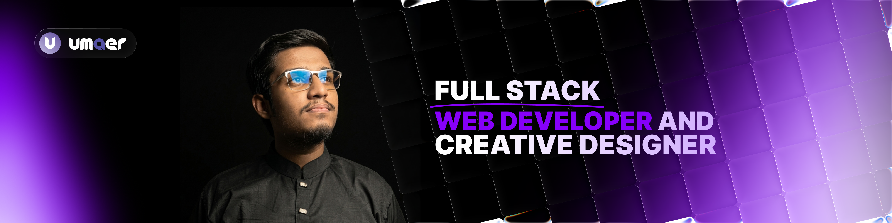

<!-- ============================== HEADER ============================== -->

<p align="center">
  
</p>

<p align="center">
  <a href="https://umaerislam.com">
    
  </a>
  <a href="https://www.linkedin.com/in/umaer-islam">
    
  </a>
  <a href="mailto:umaarislam23@gmail.com">
    
  </a>
</p>

<br />

<p align="center">
  <a href="https://readme-typing-svg.demolab.com">
    
  </a>
</p>

<p align="center">
  <strong>Full Stack Web Developer & Creative Designer</strong>
  <br />
  I design and build modern, functional, and user-focused digital experiences.
</p>

---

<!-- ============================== ABOUT ============================== -->

##  About Me

I'm **Umaer Islam**, a Full Stack Web Developer & Creative Designer focused on building modern web applications and meaningful digital experiences.

My background in design gives me a different perspective on development — I care about both **how a product works and how people experience it**.

-  Currently developing my Full Stack Web Development skills
-  Background in Graphic Design & Visual Creativity
-  Working with JavaScript, TypeScript, React and modern web technologies
-  Interested in AI-driven development and practical software engineering
-  Building real-world projects to strengthen my development skills
-  Open to collaboration, opportunities and interesting projects

---

<!-- ============================== FOCUS ============================== -->

##  Currently Working On

```text
▸ Full Stack Web Development
▸ JavaScript & TypeScript
▸ React & Modern Frontend Development
▸ REST APIs & Data Handling
▸ Backend Development
▸ Database Management
▸ Real-World Project Architecture
```

---

<!-- ============================== TECH STACK ============================== -->

##  Tech Stack

### Frontend

<p>
  
</p>

### Backend & Database

<p>
  
</p>

### Tools & Design

<p>
  
</p>

---

<!-- ============================== GITHUB STATS ============================== -->

##  GitHub Stats

<p align="center">
  
  
</p>

<p align="center">
  
</p>

---

<!-- ============================== FOOTER ============================== -->

<h3 align="center"> Let's build something together</h3>

<p align="center">
  <a href="https://umaerislam.com">
    
  </a>
  <a href="https://www.linkedin.com/in/umaer-islam">
    
  </a>
  <a href="mailto:umaarislam23@gmail.com">
    
  </a>
</p>

<p align="center">
  <sub>Designed & developed with care by Umaer Islam</sub>
</p>
